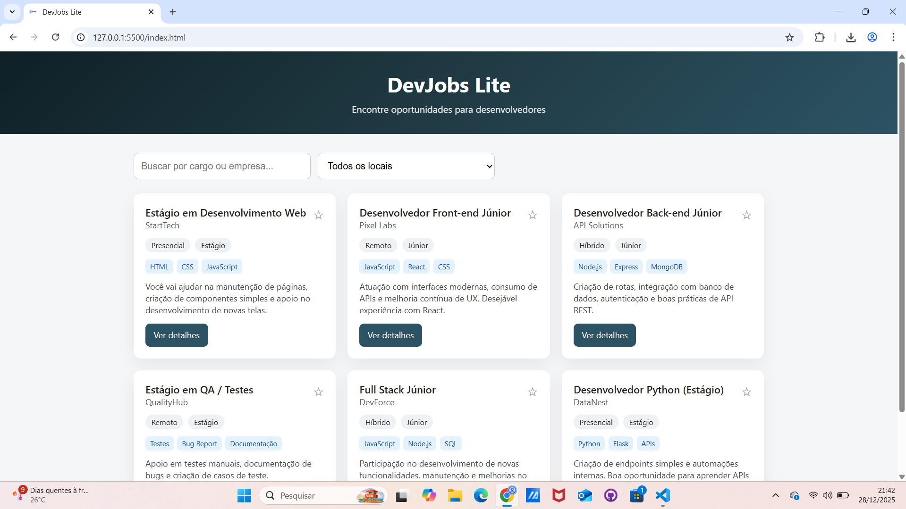
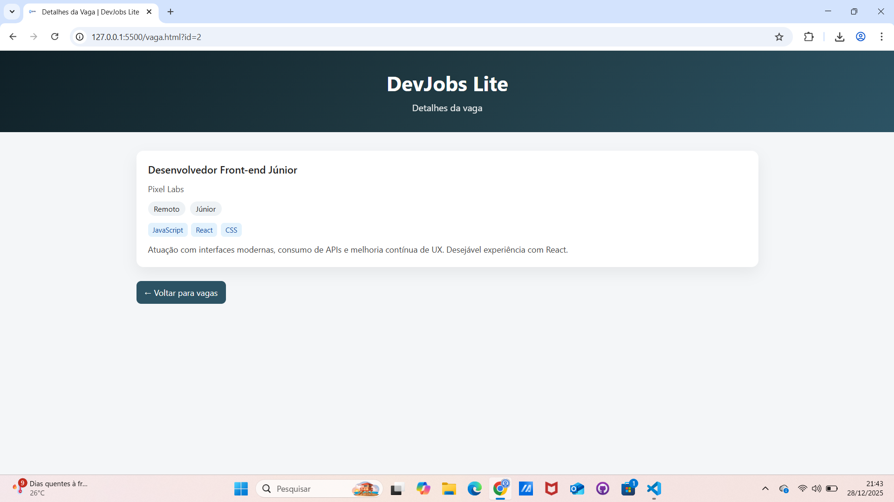

# DevJobs Lite 💼💻

O **DevJobs Lite** é um projeto front-end criado com o objetivo de **simular um mural de vagas para desenvolvedores**, permitindo visualizar, filtrar e favoritar oportunidades de forma simples e intuitiva.

Este projeto foi desenvolvido com foco em **organização de código, lógica em JavaScript e boas práticas de estruturação**, servindo como um projeto de portfólio para demonstrar habilidades em desenvolvimento web.

---

## 🎯 Objetivo do Projeto

O principal objetivo do **DevJobs Lite** é:

- Praticar **HTML, CSS e JavaScript puro**
- Simular um sistema real de listagem de vagas
- Demonstrar lógica de **filtros, busca e navegação**
- Criar um projeto **simples, funcional e bem organizado** para portfólio

---

## 🚀 Funcionalidades

- 🔍 **Busca por cargo, empresa ou tecnologia**
- 🗂️ **Filtro por tipo de trabalho** (Remoto, Presencial ou Híbrido)
- ⭐ **Sistema de favoritos** (salvo no LocalStorage)
- 📄 **Página de detalhes da vaga**
- 🔁 Navegação entre páginas sem backend
- 💡 Interface limpa e responsiva

---

## 🛠️ Tecnologias Utilizadas

- **HTML5** – estrutura das páginas  
- **CSS3** – estilização e layout responsivo  
- **JavaScript (Vanilla)** – lógica da aplicação  
- **LocalStorage** – persistência dos favoritos no navegador  

---

## 📁 Estrutura do Projeto

```
devjobs-lite/
├── assets/
│   ├── logo.png
│   └── screenshots/
│       ├── home.png
│       └── vaga.png
├── css/
│   └── style.css
├── js/
│   ├── data.js
│   ├── app.js
│   └── vaga.js
├── index.html
├── vaga.html
└── README.md
```

---

## 📸 Preview


---
---



---

## 💡 O que este projeto demonstra

- Organização de código e pastas
- Separação de responsabilidades (HTML / CSS / JS)
- Manipulação de DOM
- Leitura de parâmetros via URL
- Uso de dados simulados (mock)
- Persistência de dados no navegador
- Pensamento voltado para projetos reais

---

## 📌 Observações

Este projeto não possui backend ou banco de dados real, pois o foco é **front-end e lógica de interface**.  
As vagas são simuladas por meio de um arquivo JavaScript (`data.js`).

---

## 👨‍💻 Autor

Desenvolvido por **Luís Felipe**  
📍 Projeto criado para fins de estudo e portfólio

---

⭐ Se você gostou do projeto, sinta-se à vontade para dar uma estrela no repositório!
